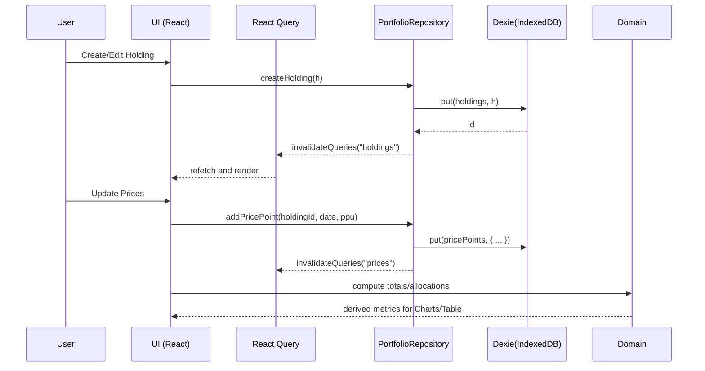

# Personal Finance Tracker — Technical Design Document (Phase 1)

## 1) Overview & Objectives

**Goal:** A local-first, single-user web app to track personal holdings across stocks, crypto, cash, real estate, and other categories. Users manually enter units and prices (Phase 1). Provide charts: allocation (pie/donut), total portfolio value over time (line), and value by category (bar). Include export/import JSON. Design for a future cloud-backed upgrade without rewriting UI or domain logic.

**Key properties (Phase 1):**
- Pure browser SPA (React + TypeScript + Vite).
- Persistent local storage with IndexedDB via Dexie.
- Repository pattern abstracting storage (local IndexedDB now, HTTP/cloud later).
- Basic charts (Recharts).
- Quality: ESLint, Prettier, Vitest (+ Testing Library), Playwright e2e.
- Accessibility (WCAG 2.1 AA) and i18n-ready.

---

## 2) System Context & Architecture

User runs the app locally in a browser. No servers, no telemetry. Data resides in IndexedDB. Domain logic is pure TypeScript. The data access is behind a `PortfolioRepository` interface. Charts read derived, memoized data computed from domain functions and cached with React Query. A Zustand store manages UI prefs (theme, currency, compact mode).

### Component Diagram (Mermaid)

```mermaid
flowchart LR
  subgraph Browser[Browser (SPA)]
    UI[UI Components & Pages<br/>React + shadcn/ui + Tailwind]
    Charts[Charts (Recharts)]
    State[State Mgmt<br/>React Query + Zustand]
    Domain[Domain Logic<br/>valuations, aggregations]
    RepoIF[Repository Interface<br/>PortfolioRepository]
    DexieImpl[Dexie Repository<br/>(IndexedDB)]
    ExportImport[Export/Import JSON]
  end

  User -->|interacts| UI
  UI --> State
  UI --> Charts
  UI --> Domain
  UI --> RepoIF
  RepoIF --> DexieImpl
  ExportImport --> RepoIF
```

### Data Flow (Mermaid)



## 3) Tech Stack Rationale

React + TypeScript + Vite: Fast dev server, TS strict typing, modern SPA.

IndexedDB via Dexie: Proven local-first DB, schema versioning, efficient indexing.

Repository Pattern: Decouples storage from domain/UI; paves way for cloud migration.

React Query: Async cache, loading/error states, mutations; works even for local DB calls.

Zustand: Minimal global UI state (prefs) with tiny footprint.

TailwindCSS + shadcn/ui: Rapid, accessible UI building blocks. (Phase 1 includes minimal shadcn-like local components to compile; actual shadcn generation planned in ADR.)

Recharts: Declarative charts with good a11y hooks and responsiveness.

Quality: ESLint + Prettier, Vitest (+ Testing Library), Playwright for e2e.

## 4) Data Model

### Entities

Holding
`{ id: string, type: 'stock'|'crypto'|'cash'|'real_estate'|'other', name: string, symbol?: string, units: number, pricePerUnit: number, currency: string, categoryId?: string, tags: string[], notes?: string, createdAt: string, updatedAt: string, isDeleted: boolean }`

PricePoint
`{ id: string, holdingId: string, dateISO: string, pricePerUnit: number }`

Category
`{ id: string, name: string, color?: string, sortOrder: number }`

AppMeta
`{ id: 'app-meta', schemaVersion: number, createdAt: string, lastBackupAt?: string }`

### Indexes (Dexie)

- holdings: id, type, categoryId, name
- pricePoints: id, holdingId, compound(holdingId + dateISO)
- categories: id, name, sortOrder
- appMeta: id

### Relationships

- Category 1..n Holdings
- Holding 1..n PricePoints

## 5) Local-First Storage Strategy & Migration Path

Storage: IndexedDB via Dexie with explicit version(1) schema. All access through PortfolioRepository.

Export/Import: JSON snapshot contains schemaVersion, arrays for each entity, and metadata. Import validates via Zod, migrates JSON to current schema if necessary.

Migration to Cloud:

- Introduce HttpPortfolioRepository implementing the same interface.
- `VITE_STORAGE_PROVIDER=local|cloud` selects provider.
- For Phase 2, map entities to server DB (SQLite/Postgres via a server with Prisma). Dexie ID strategy uses UUIDs; keep them server-compatible.

## 6) Abstraction for Market Data Providers (Future)

Define:

```ts
export interface MarketDataProvider {
  getQuote(symbol: string, type: 'stock'|'crypto'): Promise<{ price: number; currency: string; asOf: string }>;
}
```

Adapters (e.g., Yahoo, Alpha Vantage, CoinGecko) will implement this interface. Phase 1 ships a no-op/dummy adapter and no network calls, but UI design supports future bulk updates.

## 7) Domain Logic

- Valuation: `marketValue = units * pricePerUnit` (latest known price, using holding.pricePerUnit).
- Totals: Sum across holdings (exclude isDeleted).
- Allocation %: For each category/type, value / total.
- Portfolio Value Over Time: For each date in union of price points, compute sum of `units * lastKnownPriceAsOf(date)`. If a holding lacks a price on a date, use latest price before date; if none, skip holding for that date.
- Derived Metrics: top N holdings by value, count of holdings, category distributions.

## 8) State Management

- React Query: `useHoldings`, `useCategories`, `usePriceHistory` hooks wrap queries/mutations (async even for local DB).
- Zustand UI store: currency, theme (light/dark), compactTables, feature flags.
- Routing: react-router-dom with pages: Dashboard, Holdings, Categories, Settings.

## 9) Validation & Error Handling

- Zod schemas for entities and import payload.
- Form validation on submit (numeric ranges, required fields).
- Duplicate handling via name+symbol checks (soft warning).
- Repository throws typed errors; UI shows toast / inline errors.
- Import failures: show line-level errors; data remains unchanged unless successful.

## 10) UX Flows

- CRUD Holdings: table + form dialog. Inline editing price/units; soft-delete (hide by default).
- CRUD Categories: list with color and sort order.
- Manual Prices: “Update Prices” bulk editor for today; also add price per holding.
- Dashboard: total value, # holdings, top 5 by value, charts (pie/type, bar/category, line/over time).
- Settings: Export JSON, Import JSON, Load Demo Data, Clear Data.

## 11) Charts & Visualization Plan

- Pie/Donut: allocation by type, and by category (tabs).
- Bar: value by category.
- Line: total value over time (resampled by distinct price dates).
- Heat Map: Phase 2 placeholder (notes: canvas-based or virtualization on SVG; pre-aggregate bins).
- Responsiveness: all charts responsive containers; prefers reduced motion; high contrast.

## 12) Security & Privacy

- No network calls. No telemetry.
- Data stored locally in IndexedDB. Document how to clear/reset (Settings).
- Optional local encryption at rest Phase 2 (WebCrypto + passphrase). Not implemented now.
- Export data to JSON locally (download via Blob). Import from file without network.

## 13) Accessibility & Internationalization

- Semantic HTML; labelled inputs; keyboard focus order; ARIA on dialogs and tables; contrast checked via Tailwind tokens.
- i18n-ready minimal utility (`t(key)`) with English dictionary; keys centralized to avoid hard-coded strings.
- Numeric formatting via `Intl.NumberFormat` with currency support.

## 14) Testing Strategy

- Unit: domain calculations (valuation, aggregations, time series).
- Component: Holdings table renders data and computes totals.
- e2e (Playwright): Smoke test loads app, adds simple holding, sees it in table.

CI Steps: lint, typecheck, test:unit, test:component, test:e2e (headed in CI or webServer reuse).

## 15) Performance Targets

- First load < 2s on modest hardware; bundle split by route.
- Pre-codegen target ~< 100KB JS per route (unminified dev excludes). Lazy-load charts on Dashboard route.
- Query caching avoids recomputation; memoize heavy aggregations.

## 16) Migration Plan (Phase 2/3)

- Add HttpPortfolioRepository against a Cloud API; mirror repository methods.
- Introduce auth/session; sync strategies: last-write-wins for Phase 2; CRDT exploration for later.
- Server DB: Postgres via Prisma; background price jobs; caching.
- Add Market Data providers; schedule throttling and caching; respect rate limits.

## 17) Risks & Mitigations

- Data loss (local only): Provide explicit export reminders; lastBackupAt stored; Settings banner if > N days.
- IndexedDB quirks: Dexie abstracts; keep schema simple; Zod validation on import.
- Chart perf on large portfolios: Virtualize tables; aggregate time series; lazy-load charts.
- Vendor lock-in for UI: shadcn/ui is headless + Tailwind; we can re-theme later. Minimal local stubs included to compile even if shadcn generator hasn’t run.

